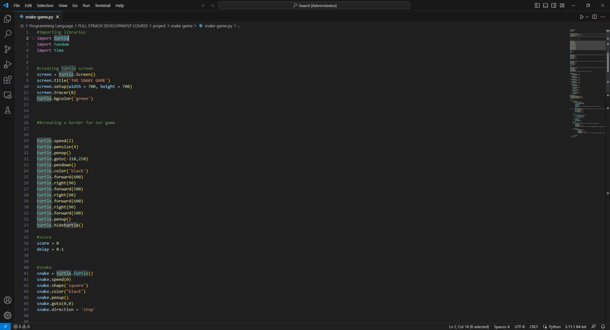
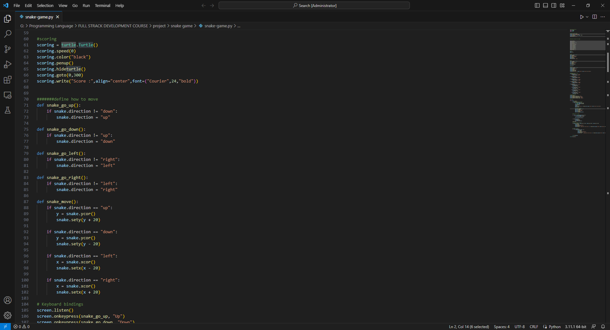
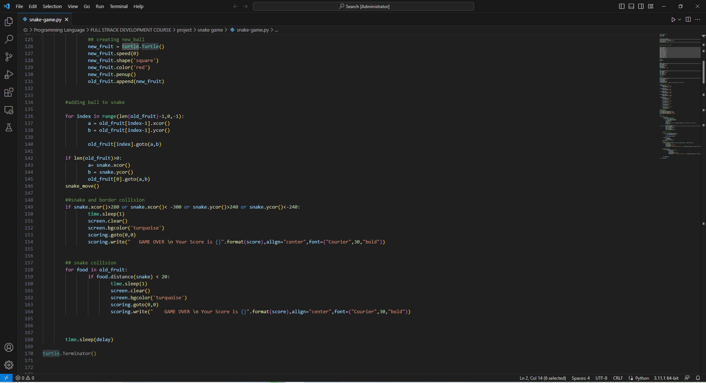
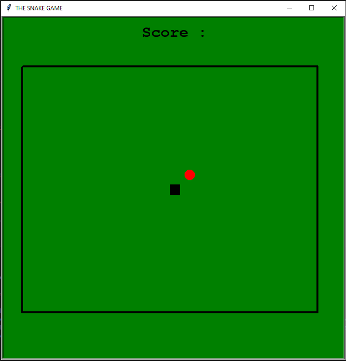
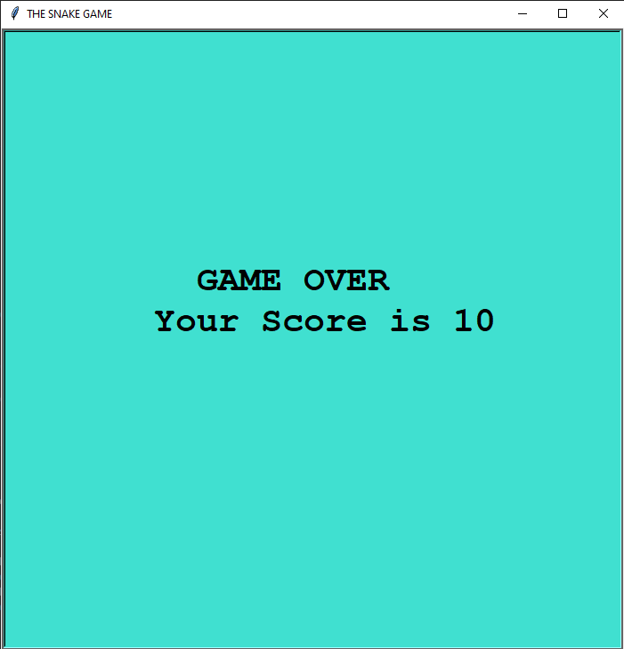

<h1>PYTHON Snake-Game</h1>

<h4>using python turtle</h4>

<h2>Introduction this Snake-Game project</h2>
The Python Snake Game is a classic arcade-style video game implemented using the Python programming language. It's a simple yet addictive game that involves controlling a snake to eat food and grow longer while avoiding collisions with the snake's own body and the game's boundaries. This game is often used as a beginner-level project for those learning Python and game development.

<h3>Key Features:</h3>
<ol>
<li>Snake Control: The player can control the movement of the snake using keyboard inputs (e.g., arrow keys or WASD keys) to navigate it across the game screen.</li>
<li>Scoring System: A scoring system keeps track of the player's score, which typically increases with each food item eaten. The player's goal is to achieve the highest score possible.</li>
<li>Collision Detection: The game monitors for collisions between the snake's head and its body or the game boundaries. If the snake collides with itself or the boundaries, it's game over.</li>
<li>Snake Growth: When the snake consumes food, it grows longer, making the game progressively more challenging as the snake becomes harder to maneuver.</li>
<li>Game Over Screen: When the snake collides with itself or the boundaries, the game displays a game over screen, showing the player's final score and offering the option to restart the game.</li>
</ol>

The Python Snake Game is an excellent project for novice programmers to learn about fundamental game development concepts like game loops, collision detection, and user input handling. It's a fun and educational way to explore Python's capabilities and improve programming skills while enjoying a classic gaming experience. You can find various tutorials and resources online to help you create your own Python Snake Game or customize it to add unique features and personal touches.

<h2>Project Code</h2>

<h2>Project GUI</h2>

